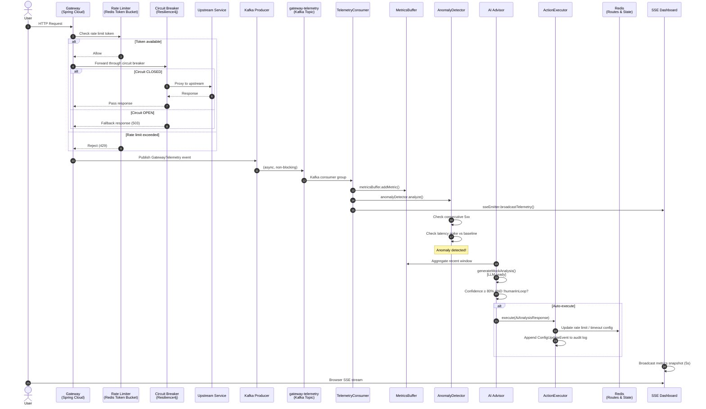
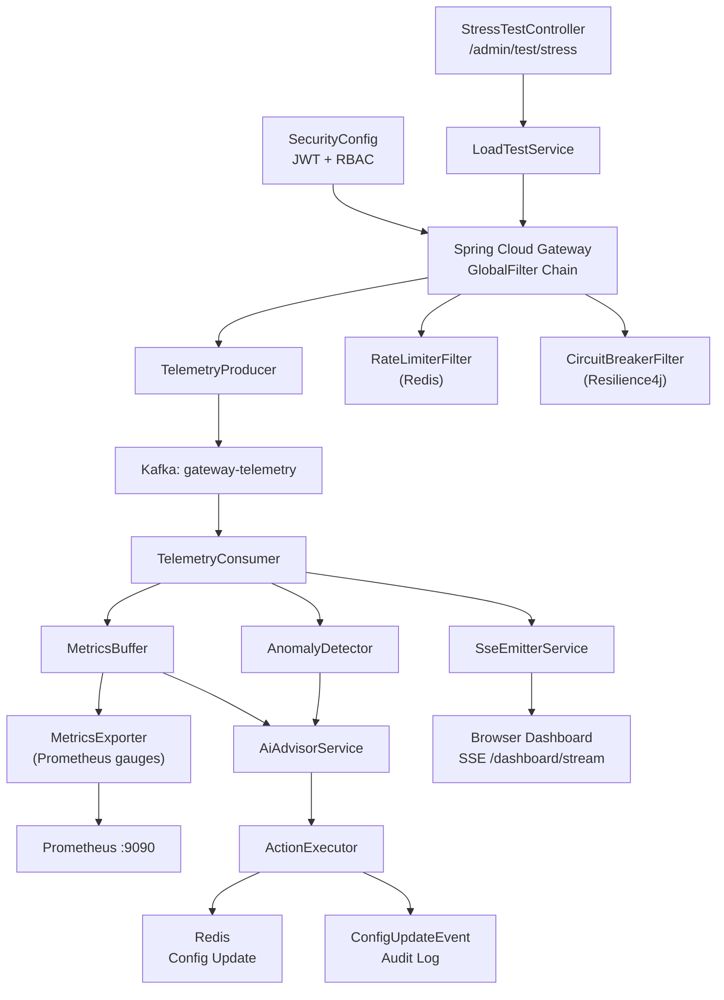

# NeuraGate — Technical Architecture

This document provides a deep-dive into the two core architectural pillars of NeuraGate:
**Event-Driven Telemetry** and **Self-Healing Circuit Breakers**.

---

## System Flow Diagram

The following diagram traces the lifecycle of a single client request through the mesh, from
ingress to autonomous remediation.



---

## Pillar 1 — Event-Driven Telemetry

### Design Goals

- **Zero coupling** between the request path and the observability pipeline.
  The gateway should never slow down because metrics processing is busy.
- **High throughput** — every request (successes, failures, rate-limited events)
  must be captured without data loss.
- **Real-time visibility** — engineers see the current state of the system
  within seconds, not minutes.

### Implementation

#### Telemetry Event (`GatewayTelemetry`)

Every request handled by the gateway results in a `GatewayTelemetry` record published to Kafka:

```json
{
  "correlationId": "550e8400-e29b...",
  "path": "/inventory/items",
  "method": "GET",
  "status": 200,
  "latency": 47,
  "timestamp": "2026-02-23T02:49:42Z",
  "rateLimited": false,
  "circuitBreakerOpen": false
}
```

#### Kafka Topic: `gateway-telemetry`

- **Partitions:** 3 (matches consumer concurrency)
- **Retention:** 7 days
- **Serialization:** JSON via Spring Kafka's `JsonSerializer`

#### Consumer Pipeline

`TelemetryConsumer` runs in consumer group `neuragate-analytics` with concurrency 3.
Each message flows through three sequential processors:

1. **`MetricsBuffer.addMetric()`** — Thread-safe ring buffer holding the last N events.
   Exposes aggregates (`getAverageLatency()`, `getErrorRate()`, `getUtilization()`) to
   Micrometer gauges scraped by Prometheus.

2. **`AnomalyDetector.analyze()`** — Stateful detector that tracks:
   - Consecutive 5xx responses (threshold: configurable, default 3)
   - Latency spikes above 200% of the rolling baseline (threshold: 500ms)

3. **`SseEmitterService.broadcastTelemetry()`** — Pushes the raw event to all
   connected browser clients over SSE in < 1ms.

#### Prometheus Integration

`MetricsExporter` registers 11 Micrometer `Gauge` beans at startup. The gauges pull
their values lazily from `MetricsBuffer` and `AnomalyDetector`:

| Metric | Description |
|---|---|
| `gateway.latency.average` | Rolling average latency (ms) |
| `gateway.error.rate` | Error rate as a percentage |
| `gateway.anomalies.total` | Cumulative anomaly count |
| `gateway.latency.baseline` | Dynamic baseline for spike detection |
| `gateway.buffer.utilization` | Ring buffer fill % |
| `gateway.circuit_breaker.count` | Open circuit breaker events |

Prometheus scrapes `/actuator/prometheus` every 15 seconds.

---

## Pillar 2 — Self-Healing Circuit Breakers

### Design Goals

- **Fail fast** — stop sending requests to an unhealthy upstream before the queue
  builds up and latency spikes for all clients.
- **Automatic recovery** — transition back to `CLOSED` state once the upstream
  shows signs of health, without operator intervention.
- **AI-guided tuning** — the AI advisor can lower circuit breaker thresholds
  *before* cascading failures occur, not just after.

### Resilience4j Configuration

NeuraGate configures a per-route circuit breaker via Spring Cloud Gateway's
`CircuitBreaker` filter:

```yaml
resilience4j:
  circuitbreaker:
    instances:
      inventoryCircuitBreaker:
        slidingWindowSize: 10
        failureRateThreshold: 50        # Trip at 50% failure rate
        waitDurationInOpenState: 10s
        permittedNumberOfCallsInHalfOpenState: 3
        automaticTransitionFromOpenToHalfOpenEnabled: true
```

**State machine:**

```
CLOSED ──(failure rate ≥ threshold)──► OPEN ──(waitDuration elapsed)──► HALF-OPEN
  ▲                                                                         │
  └─────────────(probe calls succeed)──────────────────────────────────────┘
```

### AI-Driven Tuning (`ActionExecutor`)

When `AiAdvisorService` returns a recommendation with confidence ≥ 80% and
`humanInLoop = false`, `ActionExecutor.execute()` is called:

```java
// Excerpt from ActionExecutor.java
private void tuneCircuitBreaker(AiAnalysisResponse response) {
    int newThreshold = Math.max(
        currentThreshold - MAX_CIRCUIT_BREAKER_CHANGE,
        MIN_CIRCUIT_BREAKER_THRESHOLD
    );
    auditLog.add(ConfigUpdateEvent.builder()
        .component("circuitBreaker.failureRateThreshold")
        .oldValue(String.valueOf(currentThreshold))
        .newValue(String.valueOf(newThreshold))
        .reason(response.getDiagnosis())
        .confidence(response.getConfidence())
        .triggerSource("AI_AUTO_EXECUTE")
        .timestamp(Instant.now())
        .build());
}
```

Safety limits prevent runaway automation:

| Parameter | Default | Meaning |
|---|---|---|
| `autoExecuteThreshold` | 80% | Minimum confidence to auto-apply |
| `maxRateLimitChange` | 20% | Maximum single rate-limit adjustment |
| `maxTimeoutChange` | 2000ms | Maximum single timeout adjustment |
| `humanInLoop` | true | Set false to enable autonomous execution |

### Audit Trail

Every autonomous change is recorded as a `ConfigUpdateEvent`:

```json
{
  "component": "rateLimit.requestsPerSecond",
  "oldValue": "100",
  "newValue": "80",
  "reason": "High error rate (15.3%) detected on /inventory/**",
  "confidence": 87,
  "triggerSource": "AI_AUTO_EXECUTE",
  "timestamp": "2026-02-23T02:49:42Z"
}
```

Query the audit log at `GET /ai/audit-log` (requires `ROLE_ADVISOR`).

---

## Component Dependency Map



---

## Technology Decisions

| Decision | Rationale |
|---|---|
| **Spring Cloud Gateway (reactive)** | Non-blocking I/O required to handle thousands of concurrent connections without thread exhaustion |
| **Project Loom virtual threads** | Allows simple imperative code in filters while retaining the concurrency benefits of reactive execution |
| **Kafka for telemetry** | Decouples the request path from the observability pipeline; consumer can fall behind under load without affecting the gateway |
| **Redis for rate limiting** | Atomic token bucket operations via `EVAL` scripts; shared state across gateway replicas in a future multi-node deployment |
| **JJWT 0.12.x** | Modern, actively maintained JWT library with fluent builder API; no deprecated `Keys.secretKeyFor()` |
| **Mocked AI (heuristic)** | Validates the full autonomous pipeline before committing to a specific LLM vendor; swap `generateMockAnalysis()` for an API call |

---

*This document is part of the NeuraGate 30-day engineering push. See [README.md](./README.md) for setup and usage.*
