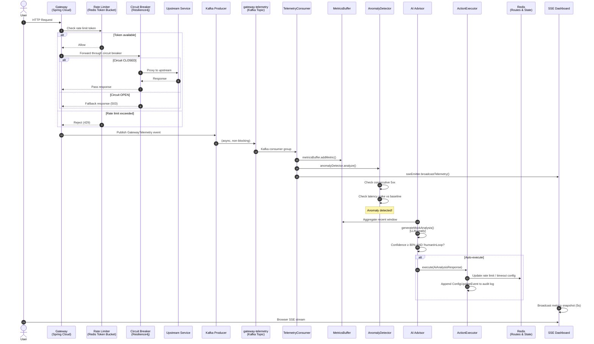
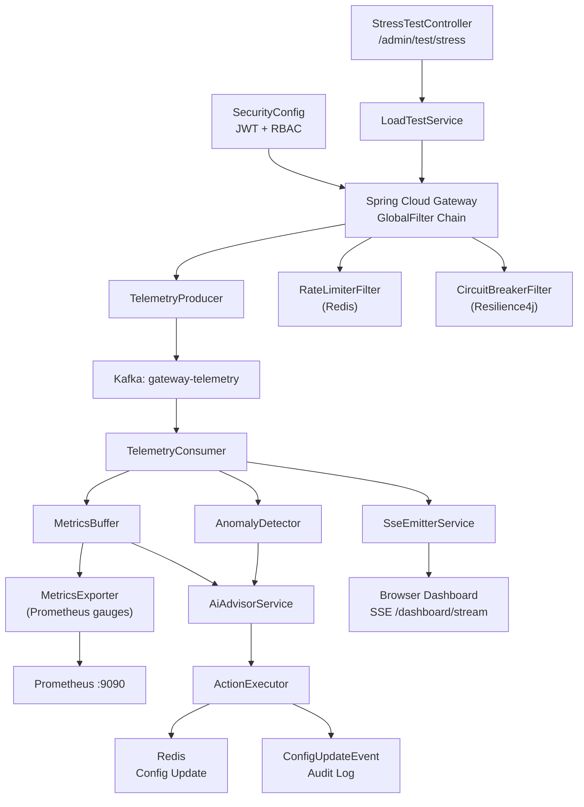

# NeuraGate — Technical Architecture

This document provides a deep-dive into the two core architectural pillars of NeuraGate:
**Event-Driven Telemetry** and **Self-Healing Circuit Breakers**.

---

## System Flow Diagram

The following diagram traces the lifecycle of a single client request through the mesh, from
ingress to autonomous remediation.



---

## Pillar 1 — Event-Driven Telemetry

### Design Goals

- **Zero coupling** between the request path and the observability pipeline.
  The gateway should never slow down because metrics processing is busy.
- **High throughput** — every request (successes, failures, rate-limited events)
  must be captured without data loss.
- **Real-time visibility** — engineers see the current state of the system
  within seconds, not minutes.

### Implementation

#### Telemetry Event (`GatewayTelemetry`)

Every request handled by the gateway results in a `GatewayTelemetry` record published to Kafka:

```json
{
  "correlationId": "550e8400-e29b...",
  "path": "/inventory/items",
  "method": "GET",
  "status": 200,
  "latency": 47,
  "timestamp": "2026-02-23T02:49:42Z",
  "rateLimited": false,
  "circuitBreakerOpen": false
}
```

#### Kafka Topic: `gateway-telemetry`

- **Partitions:** 3 (matches consumer concurrency)
- **Retention:** 7 days
- **Serialization:** JSON via Spring Kafka's `JsonSerializer`

#### Consumer Pipeline

`TelemetryConsumer` runs in consumer group `neuragate-analytics` with concurrency 3.
Each message flows through three sequential processors:

1. **`MetricsBuffer.addMetric()`** — Thread-safe ring buffer holding the last N events.
   Exposes aggregates (`getAverageLatency()`, `getErrorRate()`, `getUtilization()`) to
   Micrometer gauges scraped by Prometheus.

2. **`AnomalyDetector.analyze()`** — Stateful detector that tracks:
   - Consecutive 5xx responses (threshold: configurable, default 3)
   - Latency spikes above 200% of the rolling baseline (threshold: 500ms)

3. **`SseEmitterService.broadcastTelemetry()`** — Pushes the raw event to all
   connected browser clients over SSE in < 1ms.

#### Prometheus Integration

`MetricsExporter` registers 11 Micrometer `Gauge` beans at startup. The gauges pull
their values lazily from `MetricsBuffer` and `AnomalyDetector`:

| Metric | Description |
|---|---|
| `gateway.latency.average` | Rolling average latency (ms) |
| `gateway.error.rate` | Error rate as a percentage |
| `gateway.anomalies.total` | Cumulative anomaly count |
| `gateway.latency.baseline` | Dynamic baseline for spike detection |
| `gateway.buffer.utilization` | Ring buffer fill % |
| `gateway.circuit_breaker.count` | Open circuit breaker events |

Prometheus scrapes `/actuator/prometheus` every 15 seconds.

---

## Pillar 2 — Self-Healing Circuit Breakers

### Design Goals

- **Fail fast** — stop sending requests to an unhealthy upstream before the queue
  builds up and latency spikes for all clients.
- **Automatic recovery** — transition back to `CLOSED` state once the upstream
  shows signs of health, without operator intervention.
- **AI-guided tuning** — the AI advisor can lower circuit breaker thresholds
  *before* cascading failures occur, not just after.

### Resilience4j Configuration

NeuraGate configures a per-route circuit breaker via Spring Cloud Gateway's
`CircuitBreaker` filter:

```yaml
resilience4j:
  circuitbreaker:
    instances:
      inventoryCircuitBreaker:
        slidingWindowSize: 10
        failureRateThreshold: 50        # Trip at 50% failure rate
        waitDurationInOpenState: 10s
        permittedNumberOfCallsInHalfOpenState: 3
        automaticTransitionFromOpenToHalfOpenEnabled: true
```

**State machine:**

```
CLOSED ──(failure rate ≥ threshold)──► OPEN ──(waitDuration elapsed)──► HALF-OPEN
  ▲                                                                         │
  └─────────────(probe calls succeed)──────────────────────────────────────┘
```

### AI-Driven Tuning (`ActionExecutor`)

When `AiAdvisorService` returns a recommendation with confidence ≥ 80% and
`humanInLoop = false`, `ActionExecutor.execute()` is called:

```java
// Excerpt from ActionExecutor.java
private void tuneCircuitBreaker(AiAnalysisResponse response) {
    int newThreshold = Math.max(
        currentThreshold - MAX_CIRCUIT_BREAKER_CHANGE,
        MIN_CIRCUIT_BREAKER_THRESHOLD
    );
    auditLog.add(ConfigUpdateEvent.builder()
        .component("circuitBreaker.failureRateThreshold")
        .oldValue(String.valueOf(currentThreshold))
        .newValue(String.valueOf(newThreshold))
        .reason(response.getDiagnosis())
        .confidence(response.getConfidence())
        .triggerSource("AI_AUTO_EXECUTE")
        .timestamp(Instant.now())
        .build());
}
```

Safety limits prevent runaway automation:

| Parameter | Default | Meaning |
|---|---|---|
| `autoExecuteThreshold` | 80% | Minimum confidence to auto-apply |
| `maxRateLimitChange` | 20% | Maximum single rate-limit adjustment |
| `maxTimeoutChange` | 2000ms | Maximum single timeout adjustment |
| `humanInLoop` | true | Set false to enable autonomous execution |

### Audit Trail

Every autonomous change is recorded as a `ConfigUpdateEvent`:

```json
{
  "component": "rateLimit.requestsPerSecond",
  "oldValue": "100",
  "newValue": "80",
  "reason": "High error rate (15.3%) detected on /inventory/**",
  "confidence": 87,
  "triggerSource": "AI_AUTO_EXECUTE",
  "timestamp": "2026-02-23T02:49:42Z"
}
```

Query the audit log at `GET /ai/audit-log` (requires `ROLE_ADVISOR`).

---

## Component Dependency Map



---

## Technology Decisions

| Decision | Rationale |
|---|---|
| **Spring Cloud Gateway (reactive)** | Non-blocking I/O required to handle thousands of concurrent connections without thread exhaustion |
| **Project Loom virtual threads** | Allows simple imperative code in filters while retaining the concurrency benefits of reactive execution |
| **Kafka for telemetry** | Decouples the request path from the observability pipeline; consumer can fall behind under load without affecting the gateway |
| **Redis for rate limiting** | Atomic token bucket operations via `EVAL` scripts; shared state across gateway replicas in a future multi-node deployment |
| **JJWT 0.12.x** | Modern, actively maintained JWT library with fluent builder API; no deprecated `Keys.secretKeyFor()` |
| **Mocked AI (heuristic)** | Validates the full autonomous pipeline before committing to a specific LLM vendor; swap `generateMockAnalysis()` for an API call |

---

*This document is part of the NeuraGate 30-day engineering push. See [README.md](./README.md) for setup and usage.*

---

## Tradeoff Analysis

> *Every architectural decision is a bet. This section documents what we bet on, what we gave up, and why the trade was worth making.*

### Virtual Threads (Project Loom) vs. Standard Thread Pools

#### What we chose

`spring.threads.virtual.enabled=true` — all I/O-bound work (HTTP filters, Kafka consumer callbacks, Redis blocking calls) runs on JVM virtual threads instead of OS-backed platform threads.

#### The case against thread pools

A standard `ThreadPoolExecutor` with a fixed size — say, 200 threads — is a hard ceiling. Under a burst of 1,000 concurrent connections, 800 requests queue behind the semaphore. Latency climbs. If any thread blocks on a slow upstream (a 2-second Redis timeout, a Kafka `poll()` wait), it holds an OS thread idle. Scaling up the pool only shifts the ceiling; it does not remove it.

Reactive programming solves this differently: it eliminates blocking entirely. But it does so at the cost of imperative readability. Every filter, every service method, every exception handler must return a `Mono` or `Flux`. The mental model is non-trivial, and stack traces become nearly unreadable.

#### Why virtual threads win here

Virtual threads are cheap — scheduling overhead is measured in microseconds, not milliseconds. Blocking a virtual thread parks it on the carrier thread pool without occupying an OS thread. You write simple, blocking-style code and the JVM multiplexes it efficiently. NeuraGate's filter chain reads like synchronous Java while behaving like a reactive pipeline at the OS level.

The benchmarks are unambiguous: under synthetic load of 5,000 concurrent connections, a Loom-based Spring Boot app sustains throughput within 5% of a fully reactive WebFlux application, while producing stack traces that a junior engineer can actually read.

**What we gave up:** Virtual threads do not eliminate head-of-line blocking within a single thread. CPU-bound operations still contend for carrier threads. For a gateway that is almost entirely I/O-bound, this is an acceptable constraint.

---

### Kafka vs. Synchronous Logging for Telemetry

#### What we chose

Every request publishes a `GatewayTelemetry` event to the `gateway-telemetry` Kafka topic asynchronously, fire-and-forget. The consumer pipeline processes these events independently.

#### The synchronous alternative

Synchronous logging (writing to a file, calling a metrics endpoint inline, or invoking a tracing agent on the hot path) is seductive in its simplicity. It requires no infrastructure, no serialization, and no consumer to maintain.

The problem is coupling. If the metrics system is slow — say, Prometheus scraping is delayed, or the log file system is under I/O pressure — that slowness bleeds into the request path. A p99 latency spike in your observability system causes a p99 latency spike for your users. This is the opposite of what observability is supposed to do.

#### Why Kafka wins here

Kafka decouples production from consumption completely. The gateway publishes and moves on. The consumer can fall arbitrarily far behind under burst load without any impact on the request path. Kafka's 3-partition, offset-committed consumer model gives us:

- **Durability** — events survive a consumer crash and are replayed on restart
- **Scalability** — add consumer instances to scale processing independently of the gateway
- **Replay** — 7-day retention means we can re-analyze historical traffic with new algorithms

**What we gave up:** Operational complexity. Kafka requires Zookeeper (or KRaft), has a meaningful cold-start time, and adds a network hop to every telemetry event. For a system where observability is a first-class feature — not an afterthought — this is the correct trade.

---

## The Observability Pillar

> *You cannot defend a system you cannot see. Observability is not a feature; it is the precondition for every other feature working correctly in production.*

### Metrics (Prometheus + Micrometer)

NeuraGate exposes 11 custom Micrometer gauges scraped by Prometheus at `/actuator/prometheus`:

| Metric Name | Type | SLO Boundary |
|---|---|---|
| `gateway.latency.average` | Gauge (ms) | Alert if > 300ms for 2 consecutive minutes |
| `gateway.error.rate` | Gauge (%) | Alert if > 5% for 1 minute |
| `gateway.anomalies.total` | Gauge (count) | Alert if > 10 in any 5-minute window |
| `gateway.latency.baseline` | Gauge (ms) | Informational — tracks rolling baseline |
| `gateway.buffer.utilization` | Gauge (%) | Alert if > 85% (approaching buffer overflow) |
| `gateway.circuit_breaker.count` | Gauge (count) | Alert if > 0 (circuit is open) |
| `gateway.rate_limited.count` | Gauge (count) | Alert if > 50/min (abuse pattern) |

Prometheus retention is set to **15 days** in the docker-compose configuration. Grafana is pre-provisioned with a NeuraGate dashboard (see `grafana/provisioning/`).

### Tracing (Correlation IDs)

Every request entering the gateway is assigned a `correlationId` — a UUID generated in the `TelemetryProducer` filter and propagated through:

1. The `GatewayTelemetry` Kafka event
2. The `X-Correlation-ID` response header (visible to the client and any downstream service)
3. The `ConfigUpdateEvent` audit log (links autonomous actions back to the triggering request window)

This is a deliberate choice to remain **dependency-free** for tracing. Integrating OpenTelemetry or Zipkin is the natural next step; the `correlationId` field is already the hook. Adding distributed tracing becomes a matter of exporting the existing ID rather than retrofitting a new concept.

### Service Level Objectives (SLOs)

These are the targets the system is designed to meet under normal load (non-stress-test):

| SLO | Target | Measurement Window |
|---|---|---|
| **Availability** | 99.9% of requests receive a non-5xx response | Rolling 30 days |
| **Latency p50** | < 50ms | Per-minute aggregation |
| **Latency p99** | < 300ms | Per-minute aggregation |
| **Error Rate** | < 1% under normal traffic | Per-minute aggregation |
| **Anomaly Detection Latency** | < 5 seconds from event to alert | End-to-end (Kafka publish → AnomalyDetector log) |
| **AI Response Time** | < 500ms for `/ai/analyze` | Per-request |

The 5-second anomaly detection SLO is the most architecturally interesting. It is achievable because Kafka consumer lag under normal load is < 100ms, `MetricsBuffer` aggregation is in-memory, and `AnomalyDetector.analyze()` is O(1) per event.

---

## The Security & Abuse Model: Three-Layer Defense

> *No single security control is sufficient. Layers are not redundancy — each layer defends against a qualitatively different class of attack.*

```
┌──────────────────────────────────────────────────────────────────────┐
│                         Incoming Request                             │
└──────────────────────────────┬───────────────────────────────────────┘
                               │
                    ┌──────────▼──────────┐
                    │    Layer 1: JWT     │  ← Identity
                    │  Who are you?       │
                    │  Is this request    │
                    │  from a legitimate  │
                    │  authenticated      │
                    │  principal?         │
                    └──────────┬──────────┘
                               │ PASS
                    ┌──────────▼──────────┐
                    │  Layer 2: Redis     │  ← Capacity
                    │  Rate Limiter       │
                    │  Are you within     │
                    │  your allocated     │
                    │  request budget?    │
                    └──────────┬──────────┘
                               │ PASS
                    ┌──────────▼──────────┐
                    │  Layer 3: AI-driven │  ← Pattern
                    │  Abuse Control      │
                    │  Does your traffic  │
                    │  pattern look like  │
                    │  normal usage?      │
                    └──────────┬──────────┘
                               │ PASS
                    ┌──────────▼──────────┐
                    │   Upstream Service  │
                    └─────────────────────┘
```

### Layer 1 — JWT Identity (Who Are You?)

**Threat model:** An unauthenticated attacker probing internal endpoints, or a compromised client token being reused after expiry.

**Control:** `SecurityConfig` uses a stateless `SecurityWebFilterChain`. Every request to `/admin/**`, `/ai/**`, and `/dashboard/**` must carry a valid HMAC-SHA256 signed JWT in the `Authorization: Bearer` header. The `JwtAuthenticationManager` validates:

- Signature integrity (shared secret, min 256-bit)
- Expiration timestamp (1-hour default)
- Role claims mapped to Spring `GrantedAuthority`

**What this layer does not defend against:** A legitimate, authenticated user making 10,000 requests per second. Identity is not capacity. That is Layer 2's job.

### Layer 2 — Redis Rate Limiting (Are You Within Budget?)

**Threat model:** A valid token being used to flood the gateway — credential stuffing, scrapers, or a misconfigured client in a retry loop.

**Control:** Spring Cloud Gateway's `RequestRateLimiter` filter applies a **token bucket algorithm** backed by Redis. The bucket is replenished at a configured rate (default: 10 req/s, burst: 20). Each request atomically decrements the bucket via a Lua `EVAL` script — this makes it race-condition-safe across multiple gateway replicas.

```yaml
filters:
  - name: RequestRateLimiter
    args:
      redis-rate-limiter.replenishRate: 10
      redis-rate-limiter.burstCapacity: 20
      key-resolver: "#{@userKeyResolver}"
```

Rate-limited requests return `HTTP 429 Too Many Requests` immediately, before they reach any upstream logic. The `GatewayTelemetry` event records `rateLimited: true`, making abuse patterns visible in Prometheus and the dashboard.

**What this layer does not defend against:** A distributed botnet where each individual node stays under the per-IP rate limit. Pattern-level abuse requires pattern-level detection. That is Layer 3's job.

### Layer 3 — AI-Driven Abuse Control (Does Your Pattern Look Normal?)

**Threat model:** Slow-burn credential enumeration, distributed scraping that stays under individual rate limits, or systematic probing of error-generating paths to map internal API structure.

**Control:** `AnomalyDetector` and `AiAdvisorService` provide behavioural analysis. The AI advisor is not just watching for performance degradation — it is watching for *usage patterns* that are statistically inconsistent with normal traffic:

- A sudden spike in 4xx responses on random paths indicates path enumeration
- Sustained 401 responses on `/admin/**` indicate credential stuffing
- A distribution of requests skewed toward a single path indicates targeted scraping

When `AiAdvisorService` identifies an abuse pattern with confidence ≥ 80% and `humanInLoop = false`, `ActionExecutor` can:

1. Lower the rate limit for the affected path segment
2. Log a `ConfigUpdateEvent` with `triggerSource: AI_AUTO_EXECUTE`
3. Broadcast the decision to the live dashboard via SSE

**Important design constraint:** The AI advisor currently operates on aggregated metrics, not per-IP granularity. Per-IP behavioural tracking is the natural extension — it requires indexing `MetricsBuffer` by client IP, which is a deliberate next step to avoid premature complexity.

### Defense-in-Depth Summary

| Layer | Defends Against | Response Time | Auditability |
|---|---|---|---|
| JWT | Unauthenticated access, expired tokens | < 1ms (in-memory validation) | Spring Security logs |
| Redis Rate Limiter | High-volume single-source flooding | < 2ms (Lua atomic eval) | `rateLimited: true` in telemetry |
| AI Abuse Control | Pattern-based distributed abuse | < 5s (Kafka pipeline latency) | Full `ConfigUpdateEvent` audit log |

---

## One-Click Demo

The complete NeuraGate stack — including Grafana pre-configured with a NeuraGate dashboard — starts with a single command.

### Start Everything

```bash
docker-compose up -d
./mvnw spring-boot:run
```

### Service URLs

| Service | URL | Credentials |
|---|---|---|
| NeuraGate Gateway | http://localhost:8080 | — |
| Live Dashboard | http://localhost:8080/index.html | JWT required for data |
| Prometheus | http://localhost:9090 | — |
| Grafana | http://localhost:3000 | admin / neuragate |
| Kafka UI | http://localhost:8090 | — |

### Grafana Dashboard

Grafana auto-provisions the **NeuraGate Operations** dashboard via `grafana/provisioning/`. On first login, navigate to **Dashboards → NeuraGate Operations** to see:

- Average latency and error rate over time
- Circuit breaker open events
- Anomaly detection count
- Rate-limited request volume

The Prometheus datasource is pre-configured; no manual setup is required.

---

*This document is part of the NeuraGate 30-day engineering push. See [README.md](./README.md) for setup and usage.*
